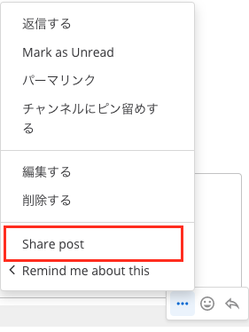
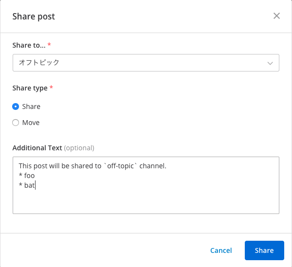
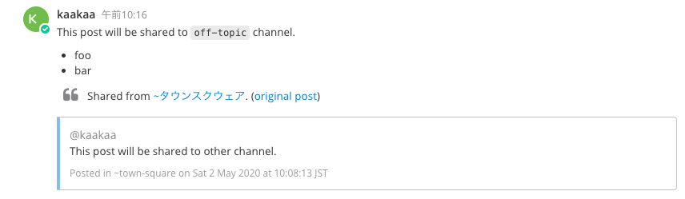

# Share Post Plugin

This plugin enable to share and move Mattermost post to other channels.

## Usage
* 1. Click post dropdown menu and select `Share post` menu

* 2. Input dialog element and push `share` button
  * **Share to...**: The channel where selected post will be shared/moved
  * **Share type**:
    * **Share**: Share the post to selected channel
    * **Move**: Move post to selected channel, and delete original post
  * **Additionall Text**: Additional text for shared/moved post. Additional text will be inserted to a head of shared/moved post 

### Shared post

### Moved post

## Notes
* Creation time of moved post is the same as original post
* After sharing post, if original post is deleted, the link to original post is invalid
* Anyone can share/move posts created by others
  * The author of moved post will be the author of original post, (not user who move the post)
* User can share/move the post to all public channel even though the user doesn't belong to the channel
* If some integrations feature for posts use postID/channelId of the post, that integrations may be disabled
  * because moving posts is creating new post and deleting original post

## Limitation
* Only the first occurrence of the link will be expanded
* In DM/GM, expanding a post is not work
* Sometimes expanding a post is not work in mobile app (#2)
* Timestamp in the footer of expanded post will probably be displayed in the server's Timezone time (#3)
  * ignoring the user's timezone setting
* Cannot share/move the post to channeld in different team
* Cannot move any reactions
* Cannot move the post that has parent posts (post thread)
  * Root post can be moved, but all children post cannot
  * It takes time to move a lot of post in threads, and **all posts in threads that are posted while moving will be force to removed**
    * In my local (macOS, 3.1GHz x2 core-i5, 16GB), it taks **40 minutes** to move 1,000 posts in thread 
    * Since moving is creating and deleting, it may take more time than the time for creating posts
* User cannot share/move the post to private channels / DM / GM
  * but the post in private channels / DM / GM can be shared/moved to public channels

## TODO
* Write tests
* Move reactions
* When sharing the post that have been already shared, attachments don't display well?
* **Might need to Mattermost changes**
  * After sharing, redirect to the new post
  * Message attachments should be enalbe to render multi images
  * Footer link in MessageAttachments
